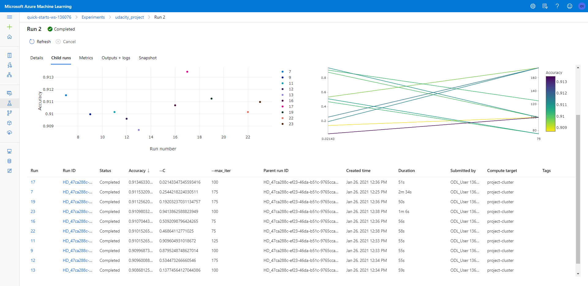
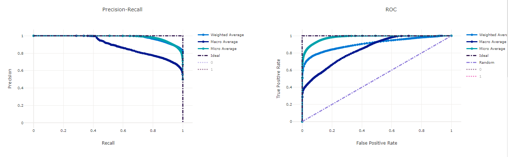

# Optimizing an ML Pipeline in Azure

## Overview
This project is part of the Udacity Azure ML Nanodegree.
In this project, we build and optimize an Azure ML pipeline using the Python SDK and a provided Scikit-learn model.
This model is then compared to an Azure AutoML run.

## Summary
This dataset contains data related to a marketing campaign, conducted over phone calls, by a bank. The goal is to predict whether or not a customer subscribed to a term deposit. In order to predict that, we take into account various characteristics of the customers some of which are age, marital status, education and type of job.

The best performing model on the bank marketing dataset was the Voting Ensemble model which had an accuracy of about 91.67%. This model was created by the Azure AutoML tool in its 38th iteration. This model was slightly more accurate than the Logistic Regression model which has accuracy of about 91.39% and was optimized using Hyperdrive.

## Scikit-learn Pipeline

The pipeline architecture can be understood using the following image:

As mentioned in the above image, we perform the following sequential steps to train an end-to-end ML model using Sklearn:
1. Fetch data using the TabularDatasetFactory class.
2. Clean the data by removing any unwanted columns and converting the categorical features into one-hot-encoded features.
3. Splitting the dataset into train and test sets to allow the model to first train on one set and then test on another.
4. Prepare the configuration for Hyperdrive and model which is to be used while training the model.
5. Train the model on the training dataset.
6. Test and evaludate the model on the test set.

The following operations were performed on the raw dataset to convert it into a form suitable for training a Logistic Regression model.
1. The textual values were converted into numerical values using the Categorical Encoding technique.
2. One-Hot-Encoding was used for columns like Contact and Education.
3. Label Encoding was used for columns like marital, housing, default, loan, month, day_of_week and also on the target column, y.
4. After preprocessing, the dataset was split into Train and Test sets where 67% of the data belonged to the Train set while the remaining belonged to the Test set.

HyperDrive was used for tuning the hyperparameters of the model. The two parameters optimized were Regularization Strength (represented by C) and Maximum number of iterations (represented by max_iters).

Since this was a Binary Classification problem, Logistic Regression was the algorithm of choice because of its simplicity and ease of implementation.

The parameter sampler automates and speeds up the process of trying out different combinations of hyperparameter values in order to obtain the most efficient model. In this case, the sampler randomly selected values for two hyperparameters namely, Regularization Strength and Maxiumum number of iteratios. The values of Regularaization Strength were randomly picked from a uniform distribution between 0 and 1. In case of Maximum number of iterations, the sampler randomly selected values from the set (25,50,75,100,125,150,175).
As evident from the above description, manually selecting values from the above ranges would be a cumbersome job. This problem can be easily mitigated by using a hyperparamter sampler, like the one provided by HyperDrive.

The early stopping policy (Bandit Policy), stops the training process in case the performance of the model starts deteriorating with increasing iteration number. This helps us retain the last best-fitted model. 

## AutoML
The AutoML run gives us the Voting Ensemble model as the most accurate model within the given stopage criteria of training for only 30 minutes. The accuracy of the model was found to be about 91.67%. A Voting Ensemble model is an ensemble model which generates its output by combining the predictions of multiple other models, thus resulting into more robust and accurate predictions.

The following parameters were generated for the Voting Ensemble model by the AutoML run:
1. reg_alpha: 0.5789 (also known as L1-Regularization which makes the model more conservative to large value changes)
2. reg_lambda: 0.4210 (also known as L2-Regularization which makes the model more conservative to large value changes)
3. subsample: 0.05
4. subsample_for_bin: 200000
5. subsample_freq: 0
6. verbose: -10

Other metrics were also generated by the AutoML run, some of which are as follows:

| Metric | Value |
|--------| -----|
| Accuracy | 0.91669 |
| AUC macro | 0.94804 |
| AUC micro | 0.98093 |
| AUC weighted | 0.94804 |
| Average precision score macro | 0.82759 |
| Average precision score micro | 0.98167 |
| Average precision score weighted | 0.95609 |
| Balanced accuracy | 0.75152 |
| F1 score macro | 0.77262 |
| F1 score micro | 0.91669 |
| F1 score weighted | 0.91306 |
| Log loss | 0.18880 |
| Matthews correlation | 0.54918 |
| Norm macro recall | 0.50304 |
| Precision score macro | 0.79986 |
| Precision score micro | 0.91669 |
| Precision score weighted | 0.91099 |
| Recall score macro | 0.75152 |
| Recall score micro | 0.91669 |
| Recall score weighted | 0.91669 |
| Weighted accuracy | 0.95771 |

## Pipeline Comparison
AutoML uses more robust data preprocessing mechanisms and generates more new features which lead to creation of more accurate models. Also, the model generated during the AutoML run were generally more complex than the Logistic Regression model trained in the previous step. Because of the aforementioned reasons, the accuracy of the model generated by AutoML run was higher than the Logistc Regression model optimized using HyperDrive.

## Future work
Below are the steps that can be followed in future for improving the performance of the model:
1. Improving the data cleaning process.
2. Ensuring that the dataset is balanaced, i.e it contains equal (or almost equal) number of records for each target class.
3. Tuning other hyperparameters of the Logistic Regression model.
4. Increasing the range of values to choose from for HyperDrive.
5. Trying out other ML models including Neural Networks.
6. Changing the stopage criteria for AutoML from time limit to a target accuracy.
7. Experimenting with the train-test split size.
8. Allow AutoML to run for longer duration.

## Proof of cluster clean up
**The compute cluster was cleaned up (deleted) using the relevant command from within the Jupyter notebook. The same can be confirmed from the image below.**

