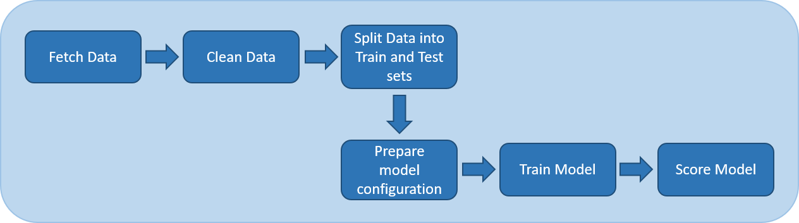
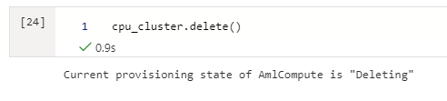

# Optimizing an ML Pipeline in Azure

## Overview
This project is part of the Udacity Azure ML Nanodegree.
In this project, we build and optimize an Azure ML pipeline using the Python SDK and a provided Scikit-learn model.
This model is then compared to an Azure AutoML run.

## Summary
This dataset contains data related to a marketing campaign, conducted over phone calls, by a bank. The goal is to predict whether or not a customer subscribed to a term deposit. In order to predict that, we take into account various characteristics of the customers some of which are age, martial status, education and type of job.

The best performing model on the bank marketing dataset was the VotingEnsemble model which had an accuracy of about 91.68%. This model was created by the Azure AutoML tool in its 38th iteration. This model was slightly more accurate than the LogisticRegression model which has accuracy of about 91.34% and was optimized using the Hyperdrive tool.

## Scikit-learn Pipeline

The pipeline architecture can be explained using the following image:

As mentioned in the above image, we perform the following sequential steps to train an end-to-end ML model using Sklearn:
1. Fetch data using the TabularDatasetFactory class.
2. Clean the data by removing any unwanted columns and converting the categorical features into one-hot-encoded features.
3. Splitting the dataset into train and test sets to allow the model to first train on one set and then test on another.
4. Prepare the configuration for Hyperdrive and model which is to be used while training the model.
5. Train the model on the training dataset.
6. Test and evaludate the model on the test set.

The following operations were performed on the raw dataset to convert it into a form suitable for training a Logistic Regression model.
1. The textual values were converted into numerical values using the Categorical Encoding technique.
2. One-Hot-Encoding was used for columns like Contact and Education.
3. Label Encoding was used for columns like matrial, housing, default, loan, month, day_of_week and also on the target column, y.
4. After preprocessing, the dataset was split into Train and Test sets where 67% of the data belonged to the Train set while the remaining belonged to the Test set.

HyperDrive was used for tuning the hyperparameters of the model. The two parameters optimized were Regularization Strength (represented by C) and Maximum number of iterations (represented by max_iters).

Since this was a Binary Classification problem, Logistic Regression was the algorithm of choice because of its simplicity and ease of implementation.

**What are the benefits of the parameter sampler you chose?**
The parameter sampler automates and speeds up the process of trying out different combinations of hyperparameter values in order to obtain the most efficient model. In this case, the sampler randomly selected values for two hyperparameters namely, Regularization Strength and Maxiumum number of iteratios. The values of Regularaization Strength were randomly picked from a uniform distribution between 0 and 1. In case of Maximum number of iterations, the sampler randomly selected values from the set (25,50,75,100,125,150,175).
As evident from the above description, manually selecting values from the above ranges would be a cumbersome job. This problem can be easily mitigated by using a hyperparamter sampler, like the one provided by HyperDrive.

**What are the benefits of the early stopping policy you chose?**

## AutoML
**In 1-2 sentences, describe the model and hyperparameters generated by AutoML.**

## Pipeline comparison
**Compare the two models and their performance. What are the differences in accuracy? In architecture? If there was a difference, why do you think there was one?**

## Future work
**What are some areas of improvement for future experiments? Why might these improvements help the model?**

## Proof of cluster clean up
**The compute cluster was cleaned up (deleted) using the relevant command from within the Jupyter notebook. The same can be confirmed from the image below.**

